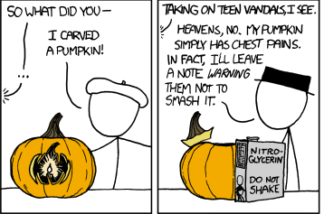
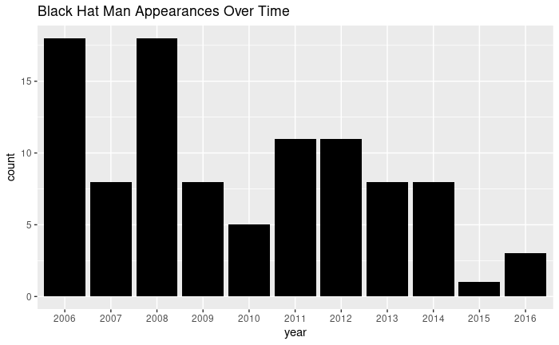
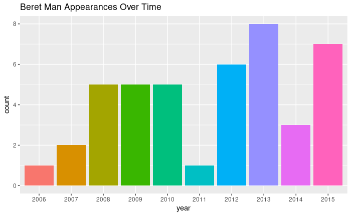
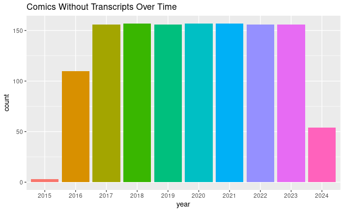

<!--
theme: gaia
class: lead
-->

<style>
section {
    font-size: 250%;
}
</style>

# XKCD Comic Analysis

## Preston Knepper and Kevin McCall

### May 7, 2024


---

# Introduction


In this project, we take a look at xkcd comics across the life of the webcomic to find interesting patterns and abnormalities, as well as challenge our abilities to parse and clean data which was never meant to be studied.

---

# Background

XKCD refers to itself as "A web-comic of romance, sarcasm, math, and language", taking its roots in nerdy humor typically about technology, math, physics and science. XKCD is popular in the world covered by those topics. The comic is posted regularly on every Monday, Wednesday, and Friday.


---

## Gathering the Data

*   Monroe offers a JSON API for his comic.
*   It should be easy to parse comics into a .csv.
*   Which turned out to not be true.
    

---

<style scoped>
section {
    font-size: 150%
}
</style>

## A look at the JSON

* month: The month of the the year this comic was posted (as a number).
* num: The comic number.
* link: An external link on image click.
* year: The year the comic was posted.
* news: Comic news to display to the reader.
* safe_title: A version of the title safe for all browsers.
* transcript: The bane of this project.
* alt: The alt text (mouseover) of the comic.
* img: A link to the comic image.
* title: The title of the comic.
* day: The day of the month the comic was posted.


---

<style scoped>
section {
    font-size: 200%
}
</style>
### The transcript and why it's terrible

*   The transcript is not parse friendly, it includes many commas, quotes, and newlines.
    *   When R reads a csv (through both read_csv and read.csv), it will parse **EVERY** comma as a new column.
    *   When R reads a quote, it will try to end it's current value, throwing an error.
    *   When R reads a newline '\n' character, it will immediatly create a new entry in the dataframe.

---

# Parsing the Transcript
* Handling the transcript ended up being the bane of our project.
* Several regex's were used to try to parse information from the transcript.


---

# Parsing the Data
- XKCD comics transcripts are in theatrical format.
    - Each dialog is on its own line and is preceeded by who is saying it.
- Our strategy to parse this data will be to search for text on a new like and split the character and their speech by a colon.


---

Here is an example comic to parse text from:


---

```
[[Beret Guy is heaving a vacuum cleaner overhead]]\n\n
Cueball: What are you doing?\n
[[Beret guy sets the vacuum cleaner on the ground as one would normally use it, 
but is standing atop the engine and desperately manhandling the grip.]]\n
Beret: Trying to unlock the tremendous energy of the vacuum.\n\n
[[Beret guy rises off the ground, hovering on the vacuum cleaner]]\n
Cueball: That's not what that-\n
Beret: Ha ha! It works!\n
<<BWAROUUGUMHGHHGMMM>>\n\n
Cueball: I said, that's-\n
Beret: The univere is mine to command!\n
<<GLHDFKUOUAHUUUUGUUUAAAUUAUUUUUUUGGGGGH>>\n
[[Beret guy rockets away on plume of Clean Energy]]\n\n
{{Title text: Do you think you could actually clean the living room at some point, though?}}
```

---

# Parsing Strategy
Through trial and error, we found that the easiest way to parse data in this format is to break it down into simpler stages and tackle those one at a time.
* Stage 1 - Removing Unecessary Data
* Stage 2 - Extracting Scene information
* Stage 3 - Extracing Dialog

---
### First Stage - Removing Clutter
<style scoped>
section {
    list-style-type: none;
}
</style>

- The transcript is surrounded in quotes and whitespace
- Additionally, the {{Title Text: ..}} is unecessary since our web scraping script has access to that field already, so we may remove it.

---

```
[[Beret Guy is heaving a vacuum cleaner overhead]]\n\n
Cueball: What are you doing?\n
[[Beret guy sets the vacuum cleaner on the ground as one would normally use
 it, but is standing atop the engine and desperately manhandling the grip.]]\n
Beret: Trying to unlock the tremendous energy of the vacuum.\n\n
[[Beret guy rises off the ground, hovering on the vacuum cleaner]\n
Cueball: That's not what that-\n
Beret: Ha ha! It works!\n
<<BWAROUUGUMHGHHGMMM>>\n\n
Cueball: I said, that's-\n
Beret: The univere is mine to command!\n
<<GLHDFKUOUAHUUUUGUUUAAAUUAUUUUUUUGGGGGH>>\n
[[Beret guy rockets away on plume of Clean Energy]]\n\n
```

---

### Second Stage - Extracting Scene information

# `\[\[([^\]]*)\]\]`

-   We use capturing groups and `str_match_all` to select the data inside 2 sets of parentheses
-   After parsing, we remove this data with `str_remove_all`

---

```
\n\n
Cueball: What are you doing?\n\n
Beret: Trying to unlock the tremendous energy of the vacuum.\n\n\n
Cueball: That's not what that-\n
Beret: Ha ha! It works!\n
<<BWAROUUGUMHGHHGMMM>>\n\n
Cueball: I said, that's-\n
Beret: The univere is mine to command!\n
<<GLHDFKUOUAHUUUUGUUUAAAUUAUUUUUUUGGGGGH>>\n\n\n
```

---

### Stage 2.5: Cleaning our mess

'\n' characters collapse together when removing `[[]]` blocks. 
* We may flatten these into a '\n' by making a call to `str_replace`, replacing `\n+` with a single `\n`.

---
```
\nCueball: What are you doing?\n
Beret: Trying to unlock the tremendous energy of the vacuum.\n
Cueball: That's not what that-\n
Beret: Ha ha! It works!<<BWAROUUGUMHGHHGMMM>>\n
Cueball: I said, that's-\n
Beret: The univere is mine to command!\n
<<GLHDFKUOUAHUUUUGUUUAAAUUAUUUUUUUGGGGGH>>
```
---

### Stage 3 Preparation: Removing Multiline Dialog

Some comics contain '\n' characters in a character's dialog. This is troublesome since we depend on character dialog separated by new lines.

---

### Solution: A complicated Regex

# `(?:\\n)(?!(?:.(?!\\n))+:)`

*   This regex uses _lookaheads_, a powerful regex feature that determines matches without capturing the input.

*   Lookaheads are used to match a select a \n where there is another '\n' in between it and the next ':' character

*   These are removed with a call to `str_remove_all`

---

```
\nCueball: What are you doing?\n
Beret: Trying to unlock the tremendous energy of the vacuum.\n
Cueball: That's not what that-\n
Beret: Ha ha! It works!<<BWAROUUGUMHGHHGMMM>>\n
Cueball: I said, that's-\n
Beret: The univere is mine to command!\n
<<GLHDFKUOUAHUUUUGUUUAAAUUAUUUUUUUGGGGGH>>
```

---

### Stage 3: Parsing the dialog

From our previous stages, we have reduced the burden on ourselves to parse the regex. We can finally extract the remaining 2 parts with this last regex: `(?:\\n)([^:]+):`

*   By using this regex, we get the text in between a newline and a colon. This is the name of the speaker
*   To gather the dialog, we can delimit the remaining the text by the names, leaving us with what they said!

---

```
Cueball
What are you doing?
Beret
Trying to unlock the tremendous energy of the vacuum
Cueball
That's not what that-
Beret
Ha ha! It works!<<BWAROUUGUMHGHHGMMM>>
Cueball
I said, that's-
Beret
The univere is mine to command!<<GLHDFKUOUAHUUUUGUUUAAAUUAUUUUUUUGGGGGH>>
```

---

### Inconsistent delimiters
*   [] instead of [[]]
*   no starting \n
*   colons in the text of the comic
*   Same character with multiple names
*   More coming up.

---

# Analysis

* Despite the difficulties, there is still some analysis we can perform.
* We now have a list of characters in each comic, so lets work with it.


---

## Black Hat and Beret Man


---

### Black Hat and Beret Man
* Black Hat and Beret are the two most consitant characters in the comic. 
* They are the easiest to parse from the transcript.
    * Some combination of 'Black' and 'Hat' or 'Beret' in the transcript.
* Lets look at there appearances over time. Look if you see anything wrong.

---

 

---

## Missing Transcripts

* It seems that the appearances of both characters seem to cut off after 2015, however, a quick search through the site tells us that this is wrong.
* What actually happened, however, is Munroe stopped writing transcripts for his comics starting late 2015.
* This trend went into full effect in 2016.



---

# Conclusions

* Parsing english is _Hard_.
    * Most problems came from the difficulty to distinguish from a phrase and a name, especially when names are made from descriptors.
* The transcript was never meant to be analyzed, and as such, it was very inconsistent in delimiters, naming, and overall structure.
    * We think this was most likely due to the rise of popularity of the xkcd wiki, explainxkcd.
* Regexes are extremely versatie and powerful, but are not a substitute for well structured data.

---

# Sources
- xkcd.com
- xkcd.com/json.html
- explainxkcd.com

